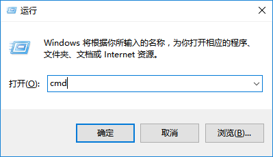
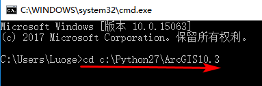
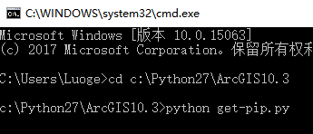
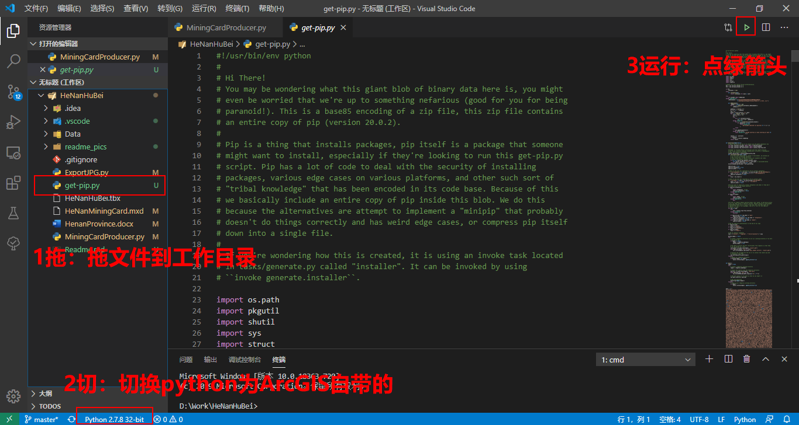
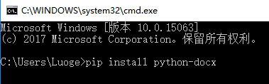

# 遥感地质调查自动出图插件

# 一、依赖环境
- ArcPy（需要安装ArcGIS Desktop）
- Python 2.7.x系列（安装ArcGIS可以选择安装Python）
- pip：python的包管理器（python 2.7.9之后的版本自带pip）
- python-docx：python读写docx文档的库，这个库依赖lxml，安装python-docx的时候会自动安装lxml。

# 二、安装ArcGIS
- 按照提示一步步安装即可。记得注意勾选安装python。安装到默认路径。
- 没有安装过的可以参考这个[网址](https://www.jb51.net/softs/682047.html#downintro2)

# 三、安装pip
**如果是python 2.7.9及其以上版本，跳过这步。**

## 1. 下载get-pip.py这个文件。下载地址：
https://bootstrap.pypa.io/get-pip.py

## 2. 安装pip
### 方法一：

（1） 打开Windows 命令提示符。进入ArcGIS安装的python目录，例如我的是：c:\Python27\ArcGIS10.3
按下Windows+R键，输入cmd。





（2） 将第一步下载的get-pip.py复制到ArcGIS的python目录下。

（3）执行 `python get-pip.py` 命令。


### 方法二：

如果你使用的IDE是VSCODE，可以这样操作：

- 将`get-pip.py`放到工作目录
- 切换python解释器为ArcGIS自带的python
- 选中该文件并运行



# 四、安装python-docx

pip安装好之后，就能使用pip安装python-docx了。

在命令行窗口中执行：

```python
pip install python-docx
```



如果安装速度不能让人满意，可以使用清华源，使用如下代码安装：

```python
pip install python-docx -i https://pypi.tuna.tsinghua.edu.cn/simple
```

若电脑存在多个版本的python，可以使用绝对路径运行安装：

```python
C:/Python27/ArcGIS10.7/python.exe -m pip install python-docx -i https://pypi.tuna.tsinghua.edu.cn/simple
```

## 注意事项：

- 运行前请清空`HeNanProvince.docx`中的所有内容，保存为空白的文档。

- 注意使用的python必须为ArcGIS自带的那个。如果不能确定，比如电脑中安装有多个python，请使用绝对路径运行。

```python
C:/Python27/ArcGIS10.3/python.exe d:/Work/HeNanHuBei/get-pip.py
```
- 先打开下mxd文件，保证在ArcGIS当中可以正常打开，否则请修复数据源。